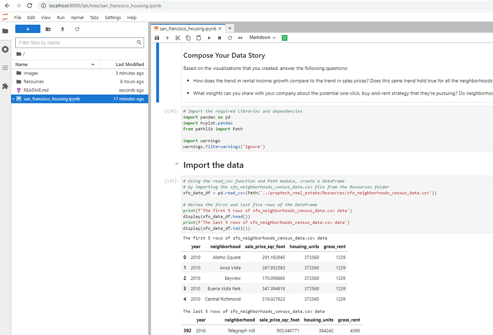

# Proptech Analyzer

Proptech, the application of technology to real-estate markets, is an innovative domain in the fintech industry. Assume that you’re an analyst at a proptech company that wants to offer an instant, one-click service for people to buy properties and then rent them. The company wants to have a trial of this offering in the San Francisco real-estate market. If the service proves popular, they can then expand to other markets.

The python based program is built to assist a Proptech sales data analyst in using data visualization skills, including aggregation, interactive visualizations, and geospatial analysis, to find properties in the San Francisco market that are viable investment opportunities.

---

## Technologies

This project leverages python 3.7.* with the following additional packages:
* [Jupyter Notebook](https://jupyter.org/) - The main module of the Financial Planner is written in Jupyter Notebook.
* [Conda](https://docs.conda.io/projects/conda/en/latest/) - Conda environment is recommended to have Pandas library and other dependencies pre-installed.

**Required Libraries:**

You may need the following libraries to work with the program.

- [Pandas](https://pandas.pydata.org/docs/reference/index.html) - pandas is a Python package providing fast, flexible, and expressive data structures designed to make working with “relational” or “labeled” data both easy and intuitive.
- [hvPlot](https://hvplot.holoviz.org/) - hvPlot provides a high-level plotting API built on HoloViews that provides a general and consistent API for plotting data in Python.

---

## Usage

To use the Proptech Analyzer application, clone the repository and run the **san_francisco_housing.ipynb** with Jupyter notebook.

From the Git Bash terminal, make sure to 'activate conda' and appropriate virtual enivorment. Next, launch the JupyterLab web-based interactive development environment (IDE) interface by typing at the prompt:

```python
  > jupyter lab
```

Then, browse to **san_francisco_housing.ipynb** starter code file to run the program. See the image below for a quick hint.



## Contributors

FinTech Labs, Inc.

---

## License

None